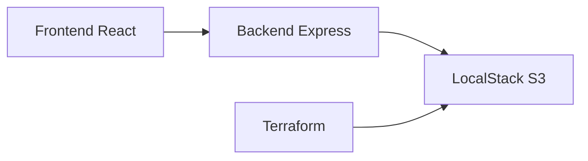

# Cloud Taller 3

Clon simple de Drive para subir archivos a un bucket S3 levantado en LocalStack. El proyecto incluye frontend, backend, Terraform y Docker Compose para que se pueda replicar en otra máquina sin instalar AWS real.

## 1. Qué hace el proyecto

- El usuario abre la web.
- El usuario arrastra o selecciona uno o varios archivos.
- El frontend envía los archivos al backend.
- El backend guarda los archivos en S3 dentro de LocalStack.
- La interfaz muestra los 3 archivos más recientes.
- También muestra todos los archivos cargados para poder descargarlos cuando se quiera.

## 2. Tecnologías utilizadas

- **Frontend:** React + Vite.
- **Backend:** Node.js + Express.
- **Infraestructura:** Terraform.
- **Emulación de AWS:** LocalStack con S3.
- **Contenerización:** Docker y Docker Compose.
- **Commits:** Conventional Commits.

## 3. Arquitectura

La arquitectura es simple:

- El frontend corre en `http://localhost:5173`.
- El backend corre en `http://localhost:3001`.
- LocalStack expone S3 en `http://localhost:4566`.
- Terraform crea el bucket `taller3-bucket` en LocalStack.

Flujo:



## 4. Estructura del proyecto

- [`frontend/`](frontend/) contiene la interfaz de usuario.
- [`backend/`](backend/) contiene la API.
- [`infra/terraform/`](infra/terraform/) contiene la infraestructura.
- [`docker-compose.yml`](docker-compose.yml) levanta todo el stack.

## 5. Archivo Terraform

El archivo principal es [`infra/terraform/main.tf`](infra/terraform/main.tf).

### Qué hace

- Define el provider de AWS apuntando a LocalStack.
- Usa credenciales dummy (`test/test`) porque no se usa AWS real.
- Crea el bucket `taller3-bucket`.
- Usa `s3_use_path_style = true` para compatibilidad con LocalStack.

### Partes importantes

- `provider "aws"`: configura el endpoint local.
- `endpoints { s3 = "http://localstack:4566" }`: le dice a Terraform que trabaje con LocalStack.
- `resource "aws_s3_bucket" "files"`: crea el bucket donde se guardan los archivos.
- `force_destroy = true`: permite borrar el bucket aunque tenga archivos si vuelves a aplicar o destruir.

## 6. Cómo ejecutar la infraestructura

Desde la raíz del proyecto:

```powershell
docker compose up -d --build
```

Si quieres ejecutar Terraform manualmente otra vez:

```powershell
docker compose run --rm terraform init
docker compose run --rm terraform apply -auto-approve
```

## 7. Evidencia en LocalStack

Puedes demostrar la infraestructura así:

```powershell
docker compose run --rm awsclic s3 ls --endpoint-url=http://localstack:4566
```

También puedes mostrar:
- el bucket `taller3-bucket`,
- los objetos cargados,
- y los logs del contenedor LocalStack con:

```powershell
docker compose logs -f localstack
```

## 8. Backend

El backend está en [`backend/src/server.js`](backend/src/server.js).

### Qué hace

- Expone `GET /health`.
- Expone `POST /upload` para subir uno o varios archivos.
- Expone `GET /files/latest` para ver los 3 archivos más recientes.
- Expone `GET /files` para ver todos los archivos cargados.
- Expone `GET /files/:key/download` para descargar cualquier archivo.
- Si el bucket no existe, lo crea automáticamente al iniciar operaciones, para que el proyecto siga funcionando después de reiniciar LocalStack.

### Variables de entorno del backend

El backend usa estas variables:

- `PORT=3001`
- `AWS_REGION=us-east-1`
- `AWS_ACCESS_KEY_ID=test`
- `AWS_SECRET_ACCESS_KEY=test`
- `S3_ENDPOINT_URL=http://localstack:4566`
- `S3_BUCKET_NAME=taller3-bucket`
- `S3_FORCE_PATH_STYLE=true`
- `MAX_FILE_SIZE=104857600`

## 9. Frontend

El frontend está en [`frontend/src/App.jsx`](frontend/src/App.jsx).

### Qué hace

- Permite arrastrar y soltar archivos.
- Permite seleccionar archivos con el explorador.
- Permite quitar archivos antes de subirlos.
- Permite subir varios archivos a la vez.
- Muestra los 3 últimos cargados.
- Muestra todos los archivos cargados para poder descargar cualquiera.

### Variables de entorno del frontend

- `VITE_API_URL=http://localhost:3001`

## 10. Comandos útiles

### Levantar todo

```powershell
docker compose up -d --build
```

### Ver estado

```powershell
docker compose ps
```

### Ver logs

```powershell
docker compose logs -f backend
docker compose logs -f frontend
docker compose logs -f localstack
```

### Probar backend

```powershell
curl.exe http://localhost:3001/health
```

### Subir un archivo de prueba

```powershell
curl.exe -X POST http://localhost:3001/upload -F "files=@C:/Users/nnath/Desktop/a/cloud taller 3/hola.txt"
```

### Ver archivos cargados

```powershell
curl.exe http://localhost:3001/files/latest
curl.exe http://localhost:3001/files
```

## 11. Cómo replicarlo en otro PC

1. Instala Docker Desktop.
2. Clona o copia el proyecto.
3. Abre una terminal en la raíz.
4. Ejecuta `docker compose up -d --build`.
5. Abre `http://localhost:5173`.
6. Si quieres verificar infraestructura, usa los comandos de Terraform y AWS CLI dentro de Docker.

## 12. Commits recomendados

- `feat: add localstack s3 bucket`
- `feat: upload files to s3`
- `feat: show latest files`
- `feat: add full file listing`
- `feat: build drive-like frontend`
- `infra: add terraform localstack config`
- `chore: add docker compose setup`

## 13. Resultado esperado

Con el proyecto levantado deberías poder:

- subir documentos, imágenes o videos,
- ver los 3 últimos archivos,
- ver todos los archivos cargados,
- descargar cualquiera de ellos,
- y repetir el flujo sin necesidad de AWS real ni base de datos.
